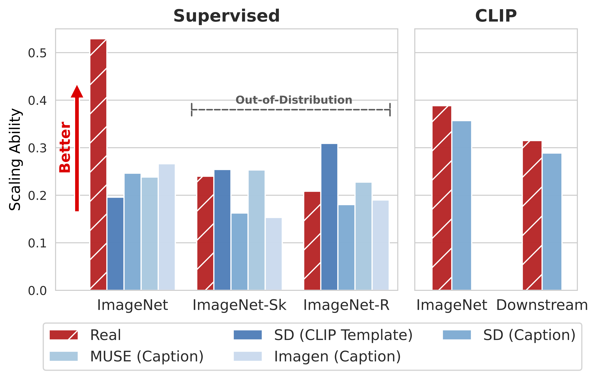

# Synthetic Image Scaling Laws

<p align="center">
  
</p>

This codebase contains PyTorch/GPU evaluation code for models in paper [Scaling Laws of Synthetic Images for Model Training ... for Now](https://arxiv.org/abs/2312.04567):
```
@article{fan2023scaling,
  author  = {Fan, Lijie and Chen, Kaifeng and Krishnan, Dilip and Katabi, Dina and Isola, Phillip and Tian, Yonglong},
  journal = {arXiv:2312.04567},
  title   = {Scaling Laws of Synthetic Images for Model Training ... for Now},
  year    = {2023},
}
```


## Disclaimer
This is not an officially supported Google product.


## License
Apache2 license.


## Overview
- Pre-trained models with synthetic / real images at different dataset scales
- Evaluation code on ImageNet for supervised training and CLIP
#### Dependencies
- PyTorch 1.11.0
- torchvision 0.12.0
- timm 0.5.4
- [open_clip](https://github.com/mlfoundations/open_clip/tree/main)


## Supervised Training
### Models
We provide pre-trained models for supervised training on real or synthetic images of ImageNet at different dataset scales. 
Synthetic images are generated by Stable Diffusion, using different text prompt and CFG scale configurations.
<table><tbody>
<!-- START TABLE -->
<!-- TABLE HEADER -->
<th valign="center">Data</th>
<th valign="center">Text Prompt</th>
<th valign="center">CFG Scale</th>
<th valign="center">Checkpoints</th>

<!-- TABLE BODY -->
<tr>
<td align="center">Real</td>
<td align="center">N/A</td>
<td align="center">N/A</td>
<td align="center"><a href="https://www.dropbox.com/scl/fo/gvsa99k6u2uen6es55mpk/h?rlkey=l9r03yfd53zezbgxa20esibkk&dl=0">Folder</a></td>
</tr>
<tr>
<td align="center">Synthetic</td>
<td align="center">Classnames</td>
<td align="center">7.5</td>
<td align="center"><a href="https://www.dropbox.com/scl/fo/6y7jhkzlixqsg4awgi58z/h?rlkey=x4mnlj4vefey2awc7r14f5wpv&dl=0">Folder</a></td>
</tr>
<tr>
<td align="center">Synthetic</td>
<td align="center">Classnames</td>
<td align="center">2.0</td>
<td align="center"><a href="https://www.dropbox.com/scl/fo/ksvcwv8eyv233w6tvs8j2/h?rlkey=vofx2yk4musztpw2c6359278x&dl=0">Folder</a></td>
</tr>
<tr>
<td align="center">Synthetic</td>
<td align="center">CLIP Templates</td>
<td align="center">2.0</td>
<td align="center"><a href="https://www.dropbox.com/scl/fo/rhqlh8xj3chmwjsejwjff/h?rlkey=yc06uup5ks0m60opvqi8ktsfd&dl=0">Folder</a></td>
</tr>
<tr>
<td align="center">Synthetic</td>
<td align="center">IN-Captions</td>
<td align="center">2.0</td>
<td align="center"><a href="https://www.dropbox.com/scl/fo/a8rtcda9cjjm51yti70t3/h?rlkey=wv6w8v3xpiazf5okrp560vz47&dl=0">Folder</a></td>
</tr>
</tbody></table>

### Evaluation 
To evaluate supervised models,

```
cd supervised
data_path=/PATH/TO/IMAGENET
ckpt_path=/PATH/TO/SUPERVISED/CKPT
batch_size=128
python eval_imagenet_supervised.py --batch-size ${batch_size} --data-path ${data_path} --ckpt ${ckpt_path}
```


## CLIP
### Models
We provide pre-trained models for CLIP on real, synthetic or a combination of real and synthetic images of LAION-400M at different dataset scales. 
Synthetic images are generated by Stable Diffusion, using the texts from the dataset, and a CFG scale of 1.5.
<table><tbody>
<!-- START TABLE -->
<!-- TABLE HEADER -->
<th valign="center">Data</th>
<th valign="center">Checkpoints</th>

<!-- TABLE BODY -->
<tr>
<td align="center">Real</td>
<td align="center"><a href="https://www.dropbox.com/scl/fo/23hdn9d419kddooo05at0/h?rlkey=wblpi91vfgnxeuy7ehu35ki76&dl=0">Folder</a></td>
</tr>
<tr>
<td align="center">Synthetic</td>
<td align="center"><a href="https://www.dropbox.com/scl/fo/8jesaqcpy7uo5pvm4pzjz/h?rlkey=ui49fv4b6xw0dl4swp8r8ibcn&dl=0">Folder</a></td>
</tr>
<tr>
<td align="center">Synthetic+Real</td>
<td align="center"><a href="https://www.dropbox.com/scl/fo/og1ejoq81qwnhs5mk527z/h?rlkey=xuf19peshmi5qwm8preqrzegz&dl=0">Folder</a></td>
</tr>
</tbody></table>

### Evaluation 
To evaluate CLIP models,
```
cd clip
data_path=/PATH/TO/ImageNet
ckpt_path=/PATH/TO/CLIP/CKPT
batch_size=128
python eval_imagenet_clip.py --batch-size ${batch_size} --data-path ${data_path} --ckpt ${ckpt_path}
```
