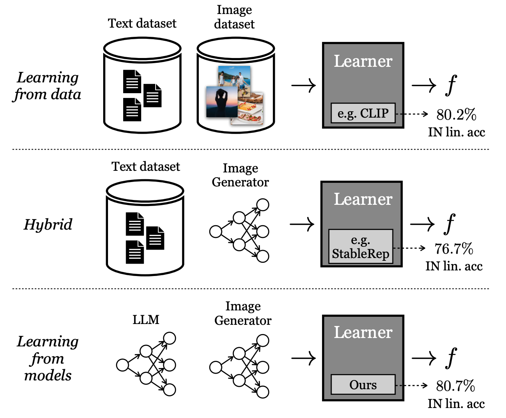

# SynCLR

<p align="center">
  
</p>

This codebase contains code and models for paper [Learning Vision from Models Rivals Learning Vision from Data](assets/synclr_paper.pdf):
```
@article{synclr2023,
  author  = {Tian, Yonglong and Fan, Lijie and Chen, Kaifeng and Katabi, Dina and Krishnan, Dilip and Isola, Phillip},
  journal = {Technical Report},
  title   = {Learning Vision from Models Rivals Learning Vision from Data},
  year    = {2023},
}
```

## Pre-trained Models
The pre-trained models can be downloaded from
- ViT-B/16, [link](https://www.dropbox.com/scl/fi/ogktmm26yojhlgsbwqqti/synclr_vit_b_16.pth?rlkey=2bn6j4upcrqy93d5b9fgrrj02&dl=0)
- ViT-L/14, [link](https://www.dropbox.com/scl/fi/al5a8d045ir0zsqo4ogpg/synclr_vit_l_14.pth?rlkey=ksyktxamcs17zqr6wha6ekdp4&dl=0)

## Dataset
For the SynCaps-150M generated in our paper, we will release it once the internal approval
process is done.

For the generated images, we will try to see if we can release them.

Otherwise, the code to synthesize the captions and images can be found
under the `synthesis` folder.

## Evaluation

Check the [README](eval/EVALUATE.md) under the `eval` folder.

## Training
Our models were trained using Jax with Google internal computation frameworks. However,
we provide a pytorch reference code under `train_pytorch`.


## Disclaimer
This is not an officially supported Google product.


## License
Apache2 license.

